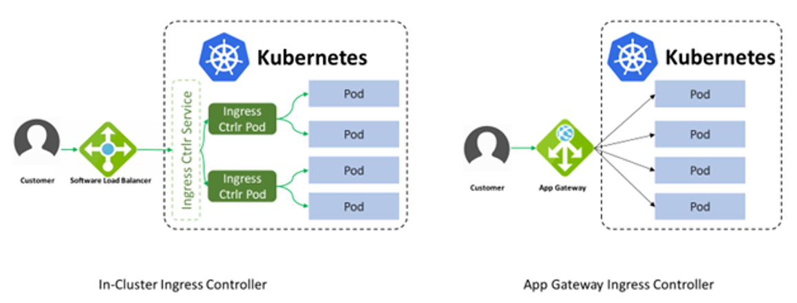

# Application Gateway Ingress Controller (AGIC) Refresher

## AGIC is

- Kubernetes extension
- Watches for changes in AKS cluster
- Continuously reconfigures AppGW
- Routes traffic to the AKS cluster

[<- Home](../readme.md) - [Next ->](02.md)