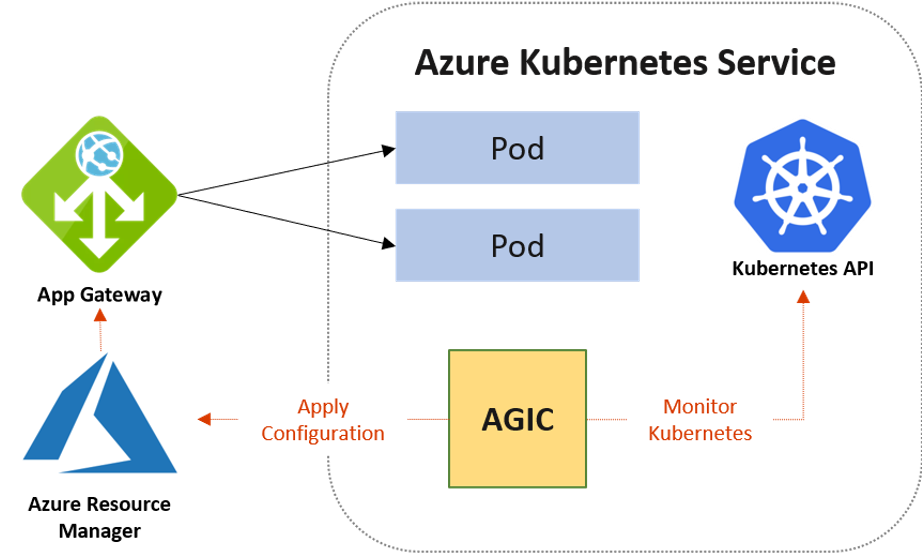

# AGIC Add-on Overview

- Originally deployed through Helm

- Now: deployed as AKS add-on via CLI, Portal, ARM (Bicep)

- Fully supported AKS and Networking CSS

- Lives in cluster

- Architecture remains the same regardless of Helm deployment or AKS add-on

[<- Previous](01.md) - [Next ->](03.md)