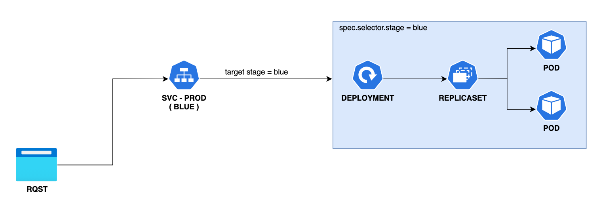
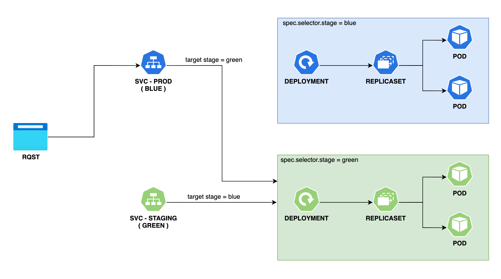

# Blue/Green deployment strategy

## What's Blue/Green

- Current version marked with a color
- The new deployment is marked with the other color
- Both version exist on the same environment, but service points to the current version
- Testing is performed against new version
- After the passing success criteria is met, the service is switched to point to the new version
- Old version is destroyed if new version works as expected, or reverted if not

## 

- Create production deployment and service (eg Blue)
  
- Deploy new version to staging/preview service and deployment (eg Green)
  
- Switch service selector to new version
  

### K8S native Blue/Green

```bash
kubectl patch <SVC> -p "{\"spec\":{\"selector\": {\"stage\": \"green\"}}}"
```

### ArgoCD

- GitOps solution that introduces custom Rollout controller
- Manages Service and deployment
- Support Canary and Blue/Green strategies

