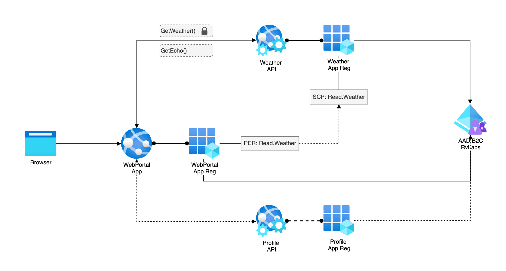

# .NET Web App calling .NET API App with Azure AD B2C AuthN/AuthZ

## Overview

The application consists of a WebPortal for interactive user login, and 2 APIs: WeatherAPI, and ProfileAPI (WIP). The architecture is very simple and basic.

### Todo

- [ ] Add more documentation
- [ ] Add IaC using Bicep to deploy App Service and Apps
- [ ] Containerize APIs and WebApp