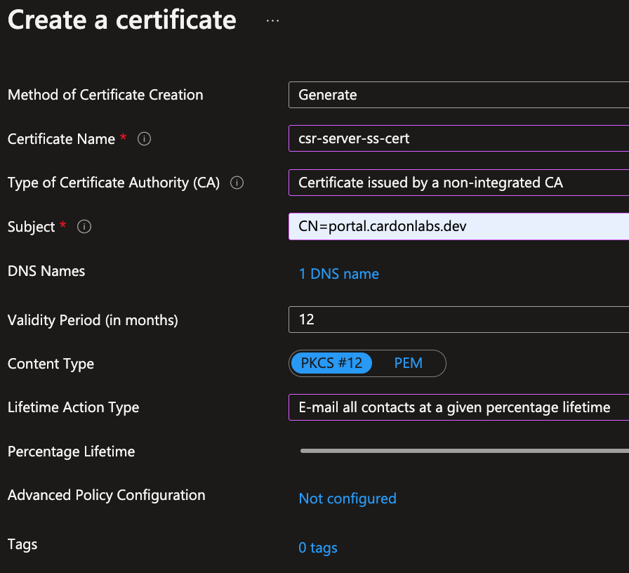
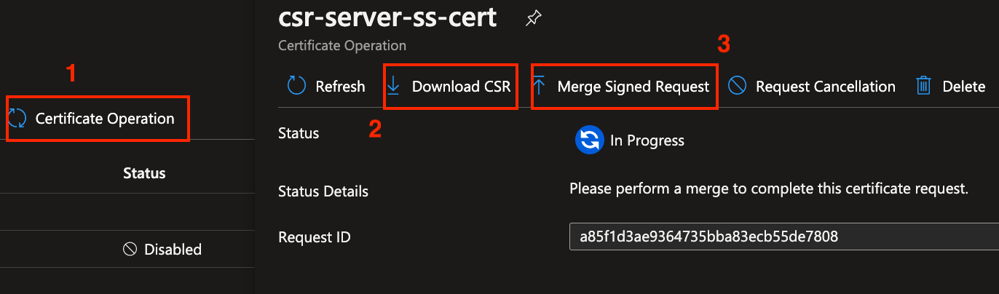
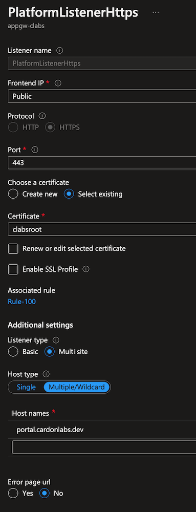
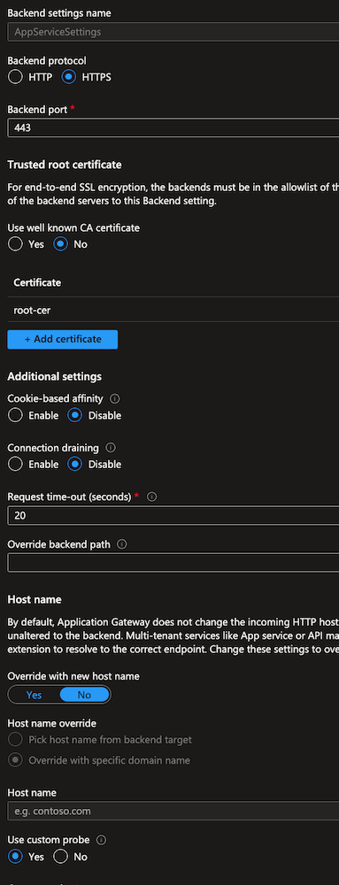

# Securing web apps and APIs with End-to-End SSL using App Gateway, APIM, and App Service

## Scenario overview

## Making It Real (MIR)

At the end of this MIR, you should have the following:

- Custom Certificate Authority
- Self-signed server certificate
- Azure KeyVault to securely store certificates
- Azure App Service with sample web app requiring authentication
- Azure API Management with sample Functions API
- Azure Application Gateway with E2E SSL and path based routing to web app and API

### Creating custom Root CA and self-signed server certificate

#### Create the root key

```bash
openssl ecparam -out root.key -name prime256v1 -genkey
```

#### Create the Root certificate and sign it

```bash
openssl req -new -sha256 -key root.key -out root.csr
Country Name (2 letter code) []:                    US
State or Province Name (full name) []:              Texas
Locality Name (eg, city) []:                        Dallas
Organization Name (eg, company) []:                 CaLabsDev
Organizational Unit Name (eg, section) []:          DC
Common Name (eg, fully qualified host name) []:     cardondev
Email Address []:                                   admin@cardondev.dev

Please enter the following 'extra' attributes
to be sent with your certificate request
A challenge password []:                            </your-password/>
```

#### Generate the root certificate

```bash
openssl x509 -req -sha256 -days 365 -in root.csr -signkey root.key -out root.crt
```

#### Use Azure Key Vault to create a Certificate Signing Request (CSR)

> If you dont already have a Key Vault, you can create one via the [Azure Portal](https://docs.microsoft.com/en-us/azure/key-vault/general/quick-create-portal) or via [Azure CLI](https://docs.microsoft.com/en-us/azure/key-vault/general/quick-create-cli)

Certificate configuration

```bash
Method of Certificate Creation      Generate
Certificate Name                    server-portal-cardonlabsdev     // Any name would do
Type of Certificate Authority       Certificate issued by a non-integrated CA
Subject                             CN=portal.cardonlabs.dev
DNS Names                           portal.cardonlabs.dev
Content Type                        PKCS #12
```



#### Create the server certificate and merge signed request in Key Vault

```bash
openssl x509 -req -in <CSR downloaded from KeyVault> /
    -CA root.crt -CAkey root.key -CAcreateserial /
    -out server.crt -days 365 -sha256 
    -extfile cert.conf -extensions Cardonlabs-Self-Signed

######
### Cert.conf
######
[ Azure-Self-Signed ]
extendedKeyUsage = serverAuth
subjectAltName = @alt_names
[alt_names]
DNS.1 = portal.cardonlabs.dev
```



At this point you should have:

- root.key / root.csr / root.crt
- csr-server-ss-cert_<GUID>.csr > This csr is downloaded from the KV certificate created earlier
- server.crt

### Prepare Azure App Service instance

#### Mapping custom domain in App Service

This configuration is very well described in the documentation section: [Map the domain](https://docs.microsoft.com/en-us/azure/app-service/manage-custom-dns-buy-domain#map-app-service-domain-to-your-app), therefore, only the differences are mentioned here and the domain to maintain consistency across this doc.

The CommonName (CN) used in the server certificate needs to match the mapped app service domain, in this doc `portal.cardonlabs.dev` has been used. Also, during the custom domain setup, it is required that a CNAME, and a TXT record are created in your DNS. This is the DNS records configuration used for this doc:

- CNAME                     my-web-portal.azurewebsites.net
- asuid.my-web-portal       "VERIFICATION ID"

> NOTE: The CNAME pointing to App Service is only needed at this moment, this will change later and point to the IP of the Application Gateway.

Refer to [Import a certificate from Key Vault](https://docs.microsoft.com/en-us/azure/app-service/configure-ssl-certificate?tabs=apex%2Cportal#import-a-certificate-from-key-vault) for detailed steps on using Key Vault certificates in App Service. Before leaving App Service, ensure you have successfully [configured the custom domain with SNI SSL binding](https://docs.microsoft.com/en-us/azure/app-service/configure-ssl-bindings#create-binding).

Lastly, configure a new virtual application by mapping `/portal` virtual path to `site\wwwroot` physical path. Review [Map a URL path to a directory](https://docs.microsoft.com/en-us/azure/app-service/configure-common?tabs=portal#map-a-url-path-to-a-directory) for a step by step guide

### Provision Azure Application Gateway

You can deploy an Application Gateway by referring to [Create Application Gateway via Portal](https://docs.microsoft.com/en-us/azure/application-gateway/quick-create-portal). This is to be used as reference and not to tull detail. 

In this scenario these are the AppGw components relevant to the configuration:

- Frontend IP: this is an Azure Public IP used to publicly expose App Gw to the public internet, a frontend is associated to one or more Listeners
- Listeners: a configuration set used to accept client requests
- Backend pools: a group of target resources that responds to request through App Gw
- Backend settings: a configuration set that defines how App Gw can communicate with the backends
- Rules: the criteria defined to map requests from the frontend to the backend target

The important configs to keep on mind it's about the certificates used for the Listeners, and the Backend Settings.

- The listener must use the certificate created for App Service, this means the server certificate
    
- The backend settings must use the root certificate authority created earlier, the Host type can me single or multi/wildcard. The in our sample the hostname (portal.cardonlabs.dev) must be listed under the hostnames list.
    

Once this is set, the Backend Health must show status as Healthy, otherwise the request will fail.

### Protecting APIs with Application Gateway and API Management

TODO.. Work in progress.
