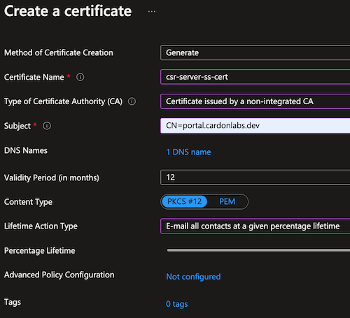
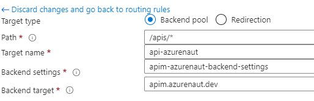

# Securing web apps and APIs with End-to-End SSL using App Gateway, APIM, and App Service

During an architecture review, some questions came up about how to protect web apps with the [Microsoft Identity Platfom](https://docs.microsoft.com/en-us/azure/active-directory/develop/), which is a straight forward effort with minimal refactoring. However, managing and routing traffic to applications with a layer 7 load balancer it's a common requirement, and in Azure this is often addressed by deploying [Azure Application Gateway](https://docs.microsoft.com/en-us/azure/application-gateway/overview). During integration of services, some challenges came up when working with OIDC redirect URL, custom domains, self-signed certificates, and url based routing.

The final solution will consist of:

- [Application Gateway](https://docs.microsoft.com/en-us/azure/application-gateway/overview)
- [App Service](https://docs.microsoft.com/en-us/azure/app-service/overview)
- [Key Vault](https://docs.microsoft.com/en-us/azure/key-vault/general/overview)
- [API Management](https://docs.microsoft.com/en-us/azure/api-management/api-management-key-concepts)

The overall solution should look as follows:


## Scenario overview

In this solution all traffic is ingested through Application Gateway to perform url based routing, and leverage end-to-end SSL

## Making It Real (MIR)

At the end of this MIR, you should have the following:

- Self-signed Certificate Authority
- Self-signed server certificate
- Azure KeyVault to securely store certificates
- Azure App Service with sample web app requiring authentication
- Azure API Management with sample Functions API
- Azure Application Gateway with E2E SSL and path based routing to web app and API

### Creating custom Root CA and self-signed server certificate

#### Create the root key

```bash
openssl ecparam -out root.key -name prime256v1 -genkey
```

#### Create the Root certificate and sign it

```bash
openssl req -new -sha256 -key root.key -out root.csr

Country Name (2 letter code) []:                    US
State or Province Name (full name) []:              Texas
Locality Name (eg, city) []:                        Dallas
Organization Name (eg, company) []:                 CaLabsDev
Organizational Unit Name (eg, section) []:          DC
Common Name (eg, fully qualified host name) []:     cardondev
Email Address []:                                   admin@cardondev.dev

Please enter the following 'extra' attributes
to be sent with your certificate request
A challenge password []:                            </your-password/>
```

#### Generate the root certificate

```bash
openssl x509 -req -sha256 -days 365 -in root.csr -signkey root.key -out root.crt
```

#### Use Azure Key Vault to create a Certificate Signing Request (CSR)

> If you dont already have a Key Vault, you can create one via the [Azure Portal](https://docs.microsoft.com/en-us/azure/key-vault/general/quick-create-portal) or via [Azure CLI](https://docs.microsoft.com/en-us/azure/key-vault/general/quick-create-cli)

Certificate configuration

```bash
* Method of Certificate Creation      Generate
* Certificate Name                    server-portal-cardonlabsdev     // Any name would do
* Type of Certificate Authority       Certificate issued by a non-integrated CA
* Subject                             CN=portal.cardonlabs.dev
* DNS Names                           portal.cardonlabs.dev
* Content Type                        PKCS #12
```



#### Create the server certificate and merge signed request in Key Vault

```bash
openssl x509 -req -in <CSR downloaded from KeyVault> /
    -CA root.crt -CAkey root.key -CAcreateserial /
    -out server.crt -days 365 -sha256 
    -extfile cert.conf -extensions Cardonlabs-Self-Signed

######
### Cert.conf
######
[ Azure-Self-Signed ]
extendedKeyUsage = serverAuth
subjectAltName = @alt_names
[alt_names]
DNS.1 = portal.cardonlabs.dev
```


At this point you should have:

- root.key / root.csr / root.crt
- csr-server-ss-cert_<GUID>.csr > This csr is downloaded from the KV certificate created earlier
- server.crt

### Prepare Azure App Service instance

#### Mapping custom domain in App Service

This configuration is very well described in the documentation section: [Map the domain](https://docs.microsoft.com/en-us/azure/app-service/manage-custom-dns-buy-domain#map-app-service-domain-to-your-app), therefore, only the differences are mentioned here and the domain to maintain consistency across this doc.

The CommonName (CN) used in the server certificate needs to match the mapped app service domain, in this doc `portal.cardonlabs.dev` has been used. Also, during the custom domain setup, it is required that a CNAME, and a TXT record are created in your DNS. This is the DNS records configuration used for this doc:

- CNAME                     my-web-portal.azurewebsites.net
- asuid.my-web-portal       "VERIFICATION ID"

> NOTE: The CNAME pointing to App Service is only needed at this moment, this will change later and point to the IP of the Application Gateway.

Refer to [Import a certificate from Key Vault](https://docs.microsoft.com/en-us/azure/app-service/configure-ssl-certificate?tabs=apex%2Cportal#import-a-certificate-from-key-vault) for detailed steps on using Key Vault certificates in App Service. Before leaving App Service, ensure you have successfully [configured the custom domain with SNI SSL binding](https://docs.microsoft.com/en-us/azure/app-service/configure-ssl-bindings#create-binding).

Lastly, configure a new virtual application by mapping `/portal` virtual path to `site\wwwroot` physical path. Review [Map a URL path to a directory](https://docs.microsoft.com/en-us/azure/app-service/configure-common?tabs=portal#map-a-url-path-to-a-directory) for a step by step guide

### Provision Azure Application Gateway

You can deploy an Application Gateway by referring to [Create Application Gateway via Portal](https://docs.microsoft.com/en-us/azure/application-gateway/quick-create-portal). This is to be used as reference and not to tull detail. 

In this scenario these are the AppGw components relevant to the configuration:

- Frontend IP: this is an Azure Public IP used to publicly expose App Gw to the public internet, a frontend is associated to one or more Listeners
- Listeners: a configuration set used to accept client requests
- Backend pools: a group of target resources that responds to request through App Gw
- Backend settings: a configuration set that defines how App Gw can communicate with the backends
- Rules: the criteria defined to map requests from the frontend to the backend target

The important configs to keep on mind it's about the certificates used for the Listeners, and the Backend Settings.

- The listener must use the certificate created for App Service, this means the server certificate

    

- The backend settings must use the root certificate authority created earlier, the Host type can me single or multi/wildcard. The in our sample the hostname (portal.cardonlabs.dev) must be listed under the hostnames list.

    

Once this is set, the Backend Health must show status as Healthy, otherwise the request will fail.

### Protecting and routing APIs with Application Gateway and API Management

This section focuses on presenting your APIs through Azure API Management (APIM) and then, exposing them to the public through Azure Application Gateway.The following specifically applies when using self-signed certificates and custom domains. Certificates issued by a well known, trusted Certificate Authoroty shortens this solutions by a few steps as leaf certificates are trusted when issued by a well known CA.

Before we start configuring and integrating the services, please note that you need to:
1. [Deploy Azure API Managemet](https://learn.microsoft.com/en-us/azure/api-management/get-started-create-service-instance-cli) 
2. [Importing your APIs](https://learn.microsoft.com/en-us/azure/api-management/import-and-publish) 
3. [Integrate Application Gateway with APIM](https://learn.microsoft.com/en-us/azure/api-management/api-management-howto-integrate-internal-vnet-appgateway)
4. [Create Azure Application Gateway](https://learn.microsoft.com/en-us/azure/application-gateway/quick-create-cli)

### Configuring Azure Application Gateway 

Creating Application Gateway should be the last step as it needs to be configured at creation. Configuration can be changed after deployment to fit your specific needs. This section will cover:

1. [Backend pools](https://learn.microsoft.com/en-us/azure/application-gateway/application-gateway-components#backend-pools): a group of target resources that responds to request through App Gw
2. [Backend settings](https://learn.microsoft.com/en-us/azure/application-gateway/application-gateway-components#http-settings): a configuration set that defines how App Gw can communicate with the backends
3. [Listeners](https://learn.microsoft.com/en-us/azure/application-gateway/application-gateway-components#listeners): a configuration set used to accept client requests, aka a configuration to listen and accept client requests
4. [Rules](https://learn.microsoft.com/en-us/azure/application-gateway/application-gateway-components#request-routing-rules): the criteria defined to map requests from the frontend to the backend target
5. [Health probes](https://learn.microsoft.com/en-us/azure/application-gateway/application-gateway-components#health-probes): monitors backend resources to route traffic to healthy endpoints only
6. [Frontend IP](https://learn.microsoft.com/en-us/azure/application-gateway/application-gateway-components#frontend-ip-addresses): this is an Azure Public IP used to publicly expose App Gw to the public internet, a frontend is associated to one or more Listeners

#### Configure Backend Pool

The backend pool is a group of target resources that responds to request through App Gw. In this scenario, the backend pool will be configured to route traffic to the APIM instance. The settings shoule be as follows:

* Name: apim-backend-pool or any name you prefer
* Target type: IP address or FQDN
* Target: apim-gateway.azurenaut.dev - the custom domain of the APIM instance's gateway endpoint

    

#### Configure Backend Settings

The backend settings is a configuration set that defines how App Gw can communicate with the backends. In this scenario, the backend settings will be configured to use the root certificate authority created earlier. Configuration is as follows:

* Name: apim-backend-settings or any name you prefer
* Backend protocol: HTTPS
* Backend port: 443
* Backend server's certificate is issued by a trusted CA: No
* Upload the root certificate authority created earlier: root-contoso-cer 
* Cookie-based affinity: Disabled
* Connection draining: Disabled
* Request timeout: 30 seconds
* Override backend path: / - This path is passed to the backend target and must exist for the request to succeed
* Override with new host name: Yes
* Host name override: Pick host name from backend target
* Use custom probe: Yes
* Custom probe: apim-health-probe - the name you used for the health probe

    

#### Configure Listeners

The listener is a configuration set used to accept client requests, aka a configuration to listen and accept client requests. In this scenario, the listener will be configured to use the server certificate created earlier. Settings are as follows:

* Name: apim-listener-https or any name you prefer
* Frontend IP: Public
* Protocol: HTTPS
* Port: 443
* Certificate: leaf-azurenaut-dev - This can be uploaded or linked to a Key Vault certificate using the Listerner TLS certificates (Preview) section
* Listener type: Multiple/Wildcard
* Host name: platform.azurenaut.dev - your custom domain

    

#### Configure Rules

Routing rule allows App Gw to send traffic from a given frontend to one or more backend targets. Here are the settings for this scenario:

* Name: apim-rule or any name you prefer
* Priority: 100
* Listener: apim-listener-https - the name of the listener created earlier
* Target type: Backend pool
* Backend target: apim-backend-pool - the name of the backend pool created earlier
* Backend setting: apim-backend-settings - the name of the backend settings created earlier
* Path based routing:
    * path: /apis/*
    * target name: api-azurenaut
    * backend setting: apim-backend-settings - or any name you prefer
    * backend pool: apim-backend-pool

        

        

        


#### Configure Health Probe

Health probes ensure that backend resources are healthy and ready to receive traffic. There should be a probe configure for each backend pool. The first one is for our APIM instance, and the second one is for our App Service instance.

* APIM health probe
    * Name: apim-health-probe or any name you prefer
    * Protocol: HTTPS
    * Pick host name from backend target: Yes
    * Pick port from backend target: Yes
    * Path: /status-0123456789abcdef
    * Interval: 30 seconds
    * Timeout: 30 seconds
    * Unhealthy threshold: 3
    * Backend setting: apim-backend-settings 

        


## Closing

At this point you should have a Web App running in App Service, a mock API in APIM, and an Application Gateway configured to route traffic to both services. This should result in traffic to https://platform.azurenaut.dev/portal to be routed to the Web App, and traffic to https://platform.azurenaut.dev/apis/azurenaut to be routed to the API in APIM.

As a bonus the path rule for /portal can be left empty, and the Web App will be the default backend target. This means that traffic to https://platform.azurenaut.dev/ will be routed to the Web App.
